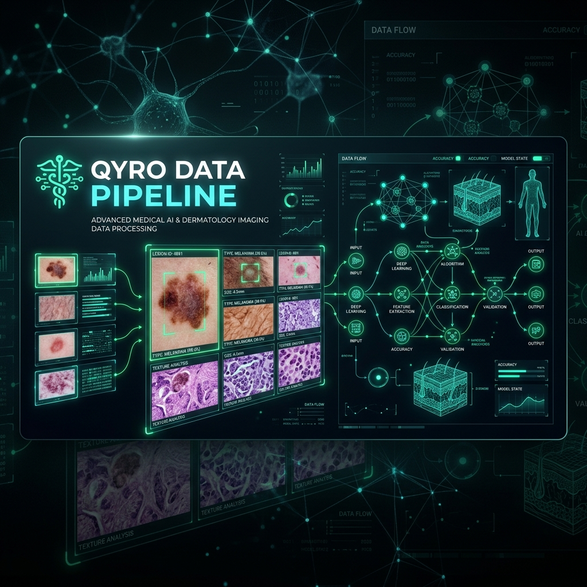

# QYRO Dataset Engineering Pipeline

An automated, reproducible dataset curation factory designed to process raw, multi-source external acne datasets and compile a premium, validated training pool (**QYRO Dataset v2.0**) for medical AI object detection models.

The system acts as a quality gate, ingestion orchestrator, and metadata indexer—routing low-quality and anomalous samples away from the training pool and preventing data contamination.

---

## 📈 Platform & Curation Summary

### **Ingestion Pipeline Yields**
| Metric | Count | Percentage / Average |
| :--- | :--- | :--- |
| **Total Ingested Images** | **16,653** | 100.0% |
| **Accepted Candidates (Curated Pool)** | **835** | **5.0% Yield Rate** |
| **Duplicates Identified & Resolved** | **1,577** | 9.5% |
| **Hard Rejected (Corrupt/Invalid)** | **256** | 1.5% |
| **Awaiting Human Triage (Review)** | **13,985** | 84.0% |
| **Curated Bounding Boxes (Acne Lesions)** | **5,561** | Average **6.7 lesions / image** |
| **Average Bounding Box Area** | — | **0.23%** of image frame |

### **Dataset Contribution Breakdowns**
| Dataset ID | Source Name | Ingested | Accepted | Review Queue | Hard Rejected | Duplicates | Total BBoxes | Yield % |
| :--- | :--- | :--- | :--- | :--- | :--- | :--- | :--- | :--- |
| **DS001** | Roboflow Acne Detection Dataset v1 | 8,481 | **274** | 7,235 | 29 | 943 | 1,824 | 3.23% |
| **DS002** | Roboflow Pimples Detection Dataset v13 | 4,409 | **149** | 3,995 | 4 | 261 | 867 | 3.38% |
| **DS003** | Roboflow Acne Detection E97Ja Dataset v5 | 1,130 | **1** | 853 | 223 | 53 | 1 | 0.09% |
| **DS004** | Roboflow Acne Detection CHP6J Dataset v1 | 1,389 | **226** | 1,084 | 0 | 79 | 1,741 | 16.27% |
| **DS005** | Roboflow Acne Vulgaris Dataset v1 | 1,244 | **185** | 818 | 0 | 241 | 1,128 | 14.87% |
| **Total** | **Combined Sources** | **16,653** | **835** | **13,985** | **256** | **1,577** | **5,561** | **5.01%** |

---

## 📦 Dataset Partition Splits (v2.0 Frozen Release)
The dataset is shuffled and split using a random seed (`42`) with strict verification tests guaranteeing **zero data leakage** across boundaries:
* **Train Split (70%)**: `584` images | `3,862` annotations
* **Val Split (15%)**: `125` images | `839` annotations
* **Test Split (15%)**: `126` images | `860` annotations
* **Image Resolution**: `640 x 640` (Letterbox resized with gray padding color `(114, 114, 114)`)

---

## 🧬 Dataset Diversity Index (Curated Pool Only)

### **Acne Severity Distribution**
* **Mild (< 5 lesions)**: `693` images (83.0%)
* **Moderate (5 to 20 lesions)**: `128` images (15.3%)
* **Severe (> 20 lesions)**: `14` images (1.7%)

### **Lighting & Skin Tone Categories**
* **Optimal Exposure**: `833` images
* **Fitzpatrick-like Skin Tone Proxy**:
  * **L2 (Medium / Tan)**: `169` images
  * **L3 (Dark / Deep)**: `664` images

---

## 🚀 Key Features

* **12-Stage Automated Pipeline**: Unified orchestration via `run_pipeline.py` spanning data integrity checking, format normalization, visual and geometry audits, deduplication, and final letterbox exporting.
* **Multi-Source Class Harmonization**: Automatically maps diverse acne annotation schemes (pustules, papules, blackheads, etc.) to a unified target class (`acne`) based on rules in the config.
* **Double-Filter Quality Scoring**: 
  * *Visual Metrics*: Measures blur (Laplacian variance) and lighting exposure (luminance histogram distribution).
  * *Label Audits*: Catches out-of-bounds bounding boxes, negative shapes, and excessive overlapping coordinates.
* **Global Deduplication & Leakage Prevention**: Leverages Difference Hashing (dHash) and MD5 hashing to resolve near-duplicates globally, ensuring that no identical or similar subject images contaminate the Train/Val/Test splits.
* **Model-in-the-Loop Consensus Audit**: Integrates a YOLOv8-based consensus audit engine to flag discrepancies between manual labels and model predictions.
* **Relational Metadata Index**: Maintains a fully traceable registry of datasets, image parameters, quality scores, and annotations inside a structured SQLite database.

---

## 🛠️ Tech Stack

* **Core Language**: Python
* **Image Processing**: OpenCV (`cv2`), Pillow (`PIL`)
* **AI Model Validation**: Ultralytics YOLOv8
* **Database Engine**: SQLite
* **Configuration & Policy Management**: YAML (PyYAML)

---

## 📁 Repository Structure

```text
workspace/
├── configs/
│   └── default_dataset_policy.yaml  # Configures quality thresholds & folder paths
│
├── database/
│   └── (sqlite databases - gitignored)
│
├── datasets/
│   └── (raw/external/curated image sets - gitignored)
│
├── docs/
│   ├── dataset_acceptance_policy.md # The Dataset v2 Quality Constitution
│   ├── repository_structure.md      # Detailed database schema maps
│   └── workflow.md                  # Explanation of the 12 pipeline stages
│
├── reports/
│   └── (markdown diagnostics and yield tracking report cards)
│
└── scripts/
    ├── import/                      # Raw ingestion and lineage tracking
    ├── conversion/                  # Annotation format harmonizers
    ├── audit/                       # Coordinate geometric validators
    ├── scoring/                     # Metric calculation engine
    ├── dedup/                       # Image hashing (dHash/MD5) comparisons
    ├── review/                      # Interface for human review queue
    ├── export/                      # Dataset splitting, letterboxing, and packaging
    └── utils/                       # DB wrappers, loggers, orchestrators
```
