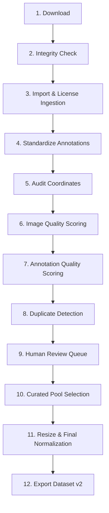

# QYRO Dataset Engineering Pipeline Workflow

This document details the 12-stage sequential workflow executed by the Acne Dataset Engineering Pipeline. The pipeline functions as a reproducible factory that processes raw external datasets and curates a premium dataset ready for medical AI model training.

---

## The 12-Stage Ingestion Pipeline

---

### Stage 1: Download
- **Objective**: Retrieve raw datasets from sources (Roboflow, Kaggle, Academic hosts, GitHub).
- **Execution**: Run download shell commands or download scripts.
- **Output**: Compressed files or directories in `workspace/datasets/external/<dataset_name>_download/`.
- **Policy**: NEVER modify files in this directory.

### Stage 2: Integrity Check
- **Objective**: Ensure downloaded resources are not corrupted or truncated.
- **Execution**: Verify files against checksum hashes (e.g. SHA256) or ensure zip/tar archives are fully readable and can extract without error.
- **Output**: Verification log file.

### Stage 3: Import & License Ingestion
- **Objective**: Map the raw download to a Dataset ID (`DSxxx`), record metadata, and copy to `datasets/raw/`.
- **Execution**:
  - Read source URL, citation, and license terms.
  - Generate `license.txt`, `source_url.txt`, and `citation.txt` under `workspace/datasets/external/<DS_ID>/`.
  - Save dataset record (ID, name, license, source URL) to the SQLite index database.
  - Copy raw images and annotations to `workspace/datasets/raw/<DS_ID>/`.

### Stage 4: Standardize Annotations
- **Objective**: Convert diverse labels format to a standardized schema.
- **Execution**:
  - Parse original annotations: COCO JSON, VOC XML, YOLO txt, or Darknet format.
  - Map various class names (e.g., *pustule*, *blackhead*, *papule*) to `acne`.
  - Write converted labels into the database's `annotations` table with `is_original=0` (Standardized) and save copy to `workspace/datasets/standardized/<DS_ID>/`.

### Stage 5: Audit Coordinates
- **Objective**: Check annotations for basic geometric validity.
- **Execution**:
  - Verify that normalized bounding boxes have $0 \le x, y, w, h \le 1.0$.
  - Flag coordinates out of bounds, negative width/height, or boxes that overlap completely.
  - Annotate invalid records in the DB table `annotations` and update image status.

### Stage 6: Image Quality Scoring
- **Objective**: Assess image quality objectively.
- **Execution**:
  - Calculate **Blurriness Score** using the variance of Laplacian.
  - Calculate **Exposure Score** based on luminance histograms to identify overly dark or bright images.
  - Record scores in the `images` database table.

### Stage 7: Annotation Quality Scoring
- **Objective**: Quantify bounding box quality.
- **Execution**:
  - Calculate box counts, box density, and average box size.
  - Assess potential clustering issues (extremely large boxes containing multiple points or overlapping annotations).
  - Write scoring results to the `images` database table.

### Stage 8: Duplicate Detection
- **Objective**: Detect exact and near-duplicate images.
- **Execution**:
  - Compute MD5 hashes for exact matching.
  - Compute Difference Hashing (dHash) and Perceptual Hashing (pHash) for near-duplicate identification.
  - Compare hashes globally. Mark matches as `duplicate` in the `images` table, linking them to their corresponding master image.

### Stage 9: Human Review Queue
- **Objective**: Route questionable samples for human triage rather than flat rejection.
- **Execution**:
  - Images with borderline quality scores (e.g., blur score between 80 and 100), possible cluster boxes, or unusual aspect ratios are marked as `review`.
  - Provide a CLI utility or export script to review these files manually.
  - Human review updates status in database to `accepted` or `rejected`.

### Stage 10: Curated Pool Selection
- **Objective**: Establish the final list of high-quality images.
- **Execution**:
  - Query SQLite DB for all images where `status = 'accepted'` and `overall_score >= MIN_THRESHOLD` (e.g., 8.0).
  - Exclude any images marked as `rejected`, `ignored`, `duplicate`, or still pending `review`.
  - Mark selected image records as `curated` in file systems and database.

### Stage 11: Resize & Final Normalization
- **Objective**: Prepare the final images and labels for the neural network.
- **Execution**:
  - Retrieve original resolutions from DB.
  - Resize images to target resolution (e.g., $640 \times 640$) using padding (letterboxing) to preserve aspect ratio.
  - Re-scale bounding box coordinates to match resized dimensions.
  - Write output files to final destination.

### Stage 12: Export Dataset v2
- **Objective**: Packages the finalized images, labels, metadata, and reports.
- **Execution**:
  - Write standard training formats (e.g., YOLO v8 layout: `images/train`, `images/val`, `labels/train`, `labels/val`).
  - Bundle lineage report, license compliance documentation, and DB snapshots.
  - Export to destination folder.
